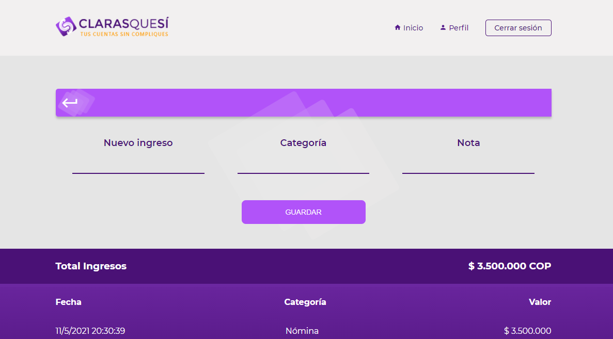
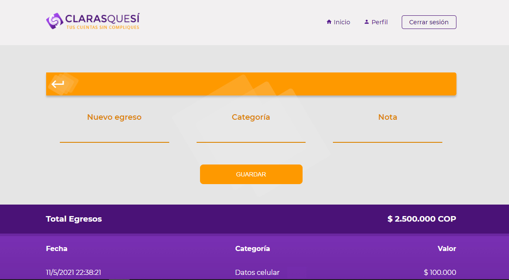

<div align= center></div>

## Contents

* [Description](https://github.com/zulsb/Claras-que-si#description)
* [Requirements](https://github.com/zulsb/Claras-que-si#requirements)
* [Files](https://github.com/zulsb/Claras-que-si#repository-contents)
* [How to install](https://github.com/zulsb/Claras-que-si#how-to-install)
* [Screenshots](https://github.com/zulsb/Claras-que-si#screenshots)
* [Authors](https://github.com/zulsb/Claras-que-si#authors)


## Description
Web application to manage personal expenses in an easy, simple and uncomplicated way, allowing you to record income and expenses, obtaining a monthly balance.

## Requirements
* Framework: React
* Languages: Javascript 
* Design: Styled component  
* Design Tools: Figma, Adobe Illustrator
* Database: Firebase 

## How to install

```bash
- git clone https://github.com/zulsb/Claras-que-si.git
- npm install
- npm run start
```


## Repository contents
ClarasQueSí - Project files:

|   **File**   |   **Description**   |
| -------------- | --------------------- |
|public/ | Contains the static files that will allow us to mount the application. |
|src/ | Contains the definition and react code of all the components to be used in the project. |
| package.json | Contains list of dependency packages.|
|README.md | File that defines the project documentation. |


## Screenshots

### Login:
Login manually or with google if you already have an account.


### Register:
Register manually or with google if you don't have an account.


### Homepage:
Main page with the total income, expenses and balance for the month.


### Income and expenses registration:
Register an income and instantly get the history and total income.



Register an expense and instantly get the history and total expenses.



## Authors

* #### Joshua Martinez <a href="https://linkedin.com/in/dantsub"></a> <a href="https://github.com/dantsub"></a>

* #### Jesús Acevedo Cano <a href="https://linkedin.com/in/jesus-acevedo-cano"></a> <a href="https://github.com/Jesus-Acevedo-Cano"></a>

* #### Paula Sotelo <a href="https://linkedin.com/in/paula-sotelo-ba-733a70"></a> <a href="https://github.com/omeinsotelo"></a>

* #### Luz Sánchez Bolaños <a href="https://linkedin.com/in/luzsanchezb"></a> <a href="https://github.com/zulsb"></a>

<p align= center>Cohort 10
<p align= center>Cali, Colombia 2021
