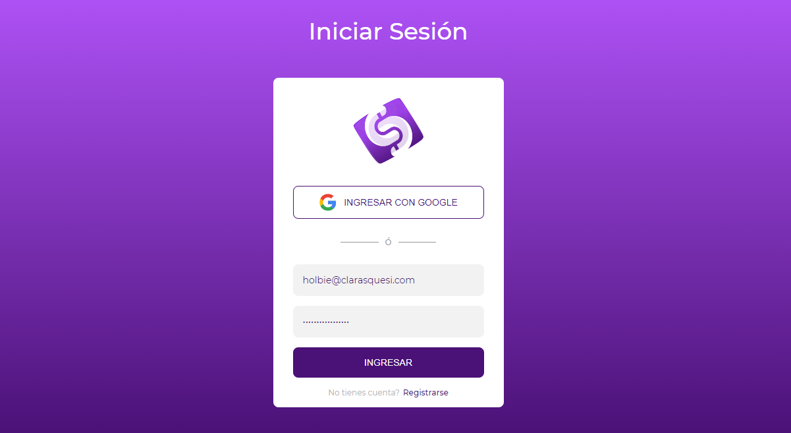
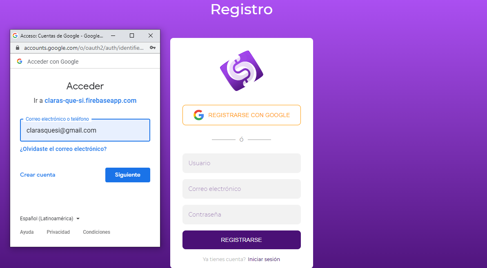
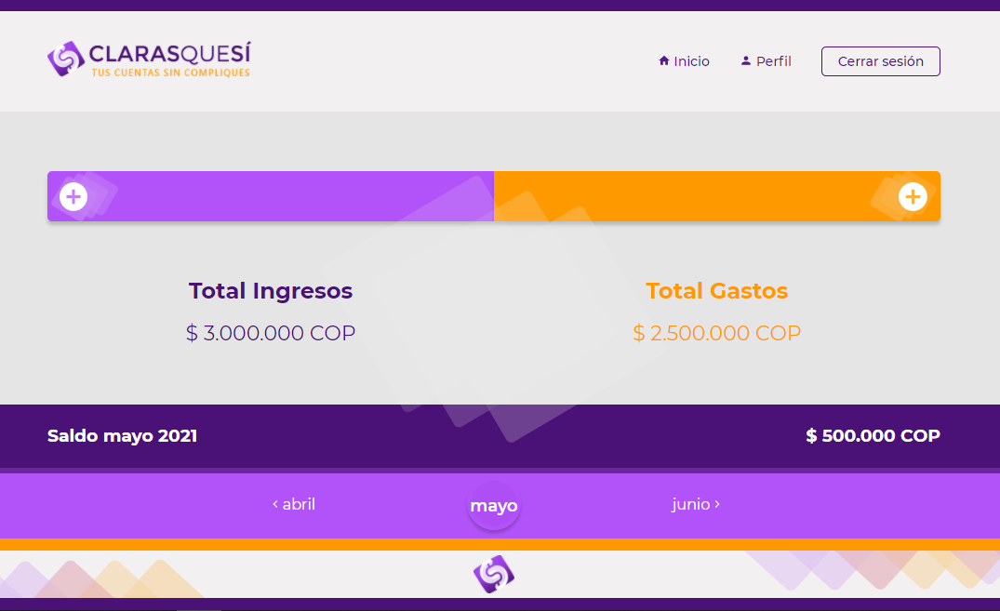

# ClarasQueSí project
<div align= center></div>

### Contents

* [Description](https://github.com/zulsb/Homecooker#description)
* [Requirements](https://github.com/zulsb/Homecooker#requirements)
* [Files](https://github.com/zulsb/Homecooker#repository-contents)
* [How to use](https://github.com/zulsb/Homecooker#how-to-use)
* [Screenshots](https://github.com/zulsb/Homecooker#screenshots)
* [Authors](https://github.com/zulsb/Homecooker#authors)
---

### Description
Web application to manage personal expenses in an easy, simple and uncomplicated way, allowing you to record income and expenses, obtaining a monthly balance.

---

## Requirements
* Framework: React
* Languages: Javascript 
* Design: styled component  
* Design Tools: Figma, Illustrator
* Database: FireBase 

---

### How to use

```bash
- git clone https://github.com/zulsb/Claras-que-si.git
- npm install
- npm run start
```
 
---

### Repository contents
ClarasQueSí - Final project files:

|   **File**   |   **Description**   |
| -------------- | --------------------- |
|public/ | Contains  |
|src/ | Contains the definition of all the components to use in the project. |
|README.md | Readme file. |

---

### Screenshots

#### Login:
Login manually or with google if you already have an account
<div align= center></div>

#### Register:
Register manually or with google if you don't have an account


#### Homepage:


#### Income and expenses registration:


---
### Authors

#### [Joshua Martinez](https://linkedin.com/in/joshuamartinez)
- Github: [dantsub](https://github.com/dantsub)

#### [Jesús Acevedo Cano](https://linkedin.com/in/jesus-acevedo-cano)
- Github: [Jesus-Acevedo-Cano](https://github.com/Jesus-Acevedo-Cano)

#### [Paula Sotelo](https://linkedin.com/in/paula-sotelo-ba-733a70)
- Github: [omeinsotelo](https://github.com/omeinsotelo)

#### [Luz Sánchez Bolaños](https://linkedin.com/in/luzsanchezb)
- Github: [zulsb](https://github.com/zulsb)

<p align= center>Cohort 10
<p align= center>Cali, Colombia 2021
